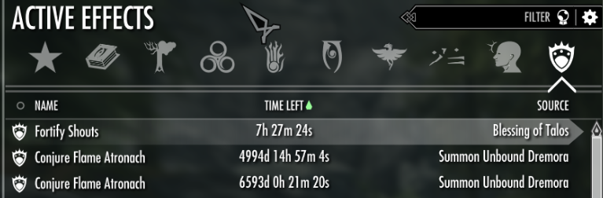

## Tips 

### 😵 Frickin last long cooldown of "Summon Unbound Dremora" spell ??

[]

> **`player.dispelallspells`** 

### 🤔 Handle most of glitch situations (item stuck, hidden chest, unresolved/bugged puzzle...) 

> **`tcl`** ---- Collision off

### Obtain all 3 greater gifts from  Hermaeus Mora ?? 

_note: quest involve with "Acquired from the Black Book Epistolary Acumen"_

```ruby
help "Dragonborn Flame" 
player.addspell [Spell_ID]
```

### NPC need to be punished ??!!

```ruby
setessential <base ID> <1/0>

1: immortal
0: mortal 
```

### Used to set the quest stage (Useful for bugged quests)
```ruby
setstage <Quest_ID> <Stage_VALUE>	
```
+ example: [quest Unholy Vigil](https://en.uesp.net/wiki/Skyrim:Unholy_Vigil)
